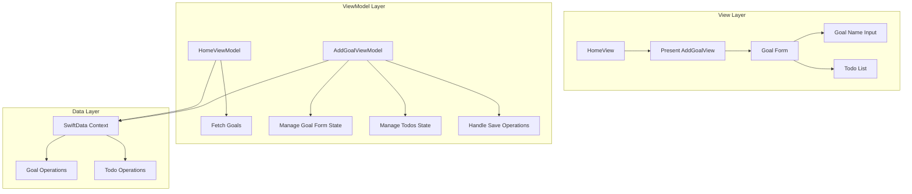

# Add Goal Feature Implementation Plan

IMPORTANT: ignore importing issues because that only happens in VSCode, I will run the code on XCode that didn't need explicit imports

## Architecture Overview



## Component Specifications

### 1. ViewModels

#### HomeViewModel
- Responsibilities:
  - Manage goals fetching and state
  - Handle goal deletion
  - Observe SwiftData changes
- Properties:
  - `@Published var goals: [GoalModel]`
  - `private let modelContext: ModelContext`
- Methods:
  - `func fetchGoals()`
  - `func deleteGoal(_ goal: GoalModel)`

#### AddGoalViewModel
- Responsibilities:
  - Manage form state
  - Handle SwiftData operations
  - Validate input
- Properties:
  - `@Published var goalName: String`
  - `@Published var todos: [TodoFormModel]`
  - `@Published var isValid: Bool`
  - `private let modelContext: ModelContext`
- Methods:
  - `func addTodo(title: String)`
  - `func removeTodo(at index: Int)`
  - `func saveGoal() async throws`
  - `private func validate()`

### 2. Views

#### AddGoalView
- Features:
  - Goal name input field
  - Todo list with add/remove functionality
  - Save button (disabled until valid)
  - Error handling and feedback
- Components:
  - TextField for goal name
  - List for todos
  - Add todo button
  - Save button with loading state

#### HomeView Updates
- Add HomeViewModel integration
- Add sheet presentation for AddGoalView
- Update goal list from ViewModel

## Validation Rules

1. Goal Name:
   - Required
   - Minimum 3 characters
   - Trimmed of whitespace

2. Todos:
   - At least 1 todo required
   - Todo title required
   - Duplicate todo titles not allowed

## Implementation Steps

1. Create ViewModels:
   ```swift
   // Create HomeViewModel
   // Create AddGoalViewModel
   ```

2. Update AddGoalView:
   ```swift
   // Update view with form
   // Add validation
   // Add error handling
   ```

3. Update HomeView:
   ```swift
   // Add ViewModel
   // Add sheet presentation
   // Update goal list
   ```

## Error Handling

1. Validation Errors:
   - Invalid goal name
   - Empty todos list
   - Invalid todo title

2. Save Errors:
   - SwiftData operation failures
   - Network connectivity (if needed)

## Testing Plan

1. ViewModel Tests:
   - Validation logic
   - Save operations
   - Error handling

2. View Tests:
   - User input validation
   - Form submission
   - Error presentation

## Next Steps

1. Switch to code mode for implementation
2. Start with ViewModel layer
3. Implement views
4. Add error handling
5. Test functionality