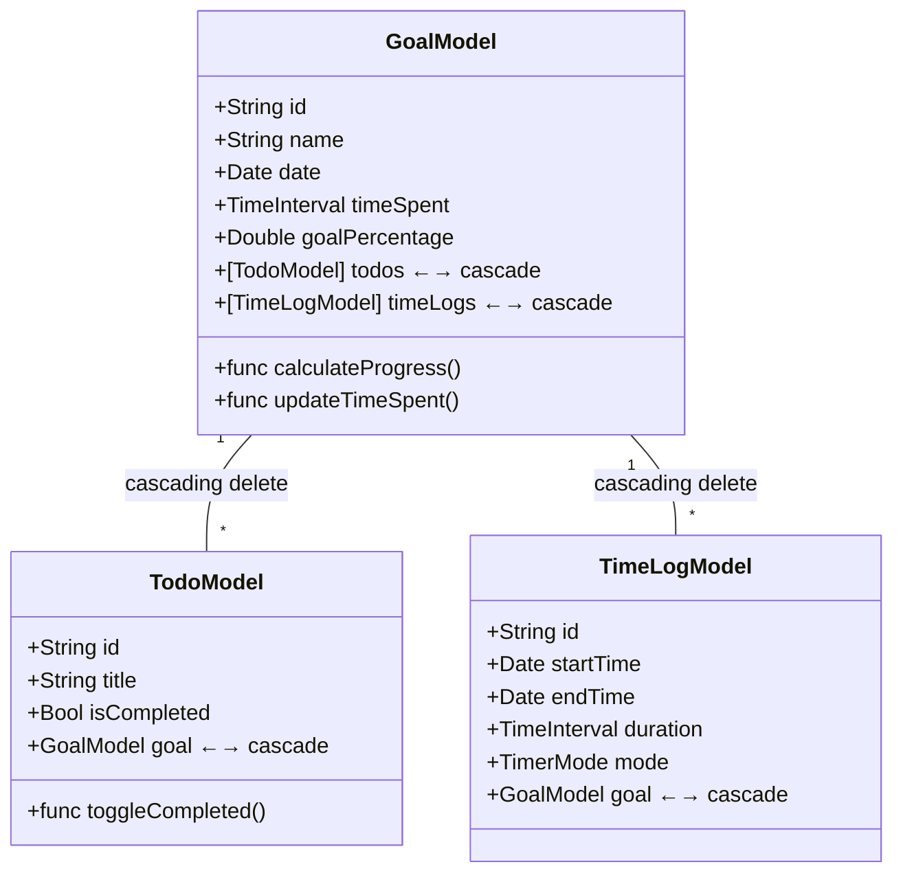

# Zone App - Data Model Architecture

## Overview
This document outlines the data model architecture for the Zone app, focusing on goal tracking, todo management, and time logging functionality.

## Model Structure

### Relationships Diagram


## Models in Detail

### GoalModel
- **Purpose**: Main entity representing a user's goal
- **Key Features**:
  - Manages relationships with todos and time logs
  - Calculates progress based on completed todos
  - Tracks total time spent through time logs
- **Properties**:
  - `id`: Unique identifier
  - `name`: Goal title
  - `date`: Creation date
  - `timeSpent`: Computed from time logs
  - `goalPercentage`: Computed from todo completion
  - `todos`: Related todo items with cascade deletion
  - `timeLogs`: Related time logs with cascade deletion
- **Computed Properties**:
  - Total time spent (calculated from time logs)
  - Progress percentage (calculated from todos)

### TodoModel
- **Purpose**: Represents individual tasks within a goal
- **Key Features**:
  - Maintains relationship to parent goal
  - Tracks completion status
- **Properties**:
  - `id`: Unique identifier
  - `title`: Task description
  - `isCompleted`: Completion status
  - `goal`: Reference to parent goal
- **Functions**:
  - `toggleCompleted()`: Toggle completion status

### TimeLogModel
- **Purpose**: Records time spent working on goals
- **Key Features**:
  - Tracks individual time sessions
  - Maintains relationship to parent goal
  - Stores timer mode used
- **Properties**:
  - `id`: Unique identifier
  - `startTime`: Session start time
  - `endTime`: Session end time
  - `duration`: Session duration
  - `mode`: Timer mode used (work, short break, long break)
  - `goal`: Reference to parent goal

## Data Relationships

### Cascade Deletion
- When a `GoalModel` is deleted:
  1. All associated `TodoModel` instances are automatically deleted
  2. All associated `TimeLogModel` instances are automatically deleted
- Implementation uses SwiftData's `@Relationship(deleteRule: .cascade)`

### Data Integrity
- No orphaned todos or time logs
- Automatic cleanup of related data
- Consistent deletion behavior across the app

## Implementation Notes

### SwiftData Configuration
```swift
@Model
final class GoalModel {
    @Relationship(deleteRule: .cascade) var todos: [TodoModel]
    @Relationship(deleteRule: .cascade) var timeLogs: [TimeLogModel]
}
```

### Updating Time Spent
- Total time spent is calculated by summing durations from time logs
- Updates automatically when new time logs are added or removed

### Progress Calculation
- Goal progress is calculated based on the ratio of completed todos
- Updates automatically when todos are completed or added